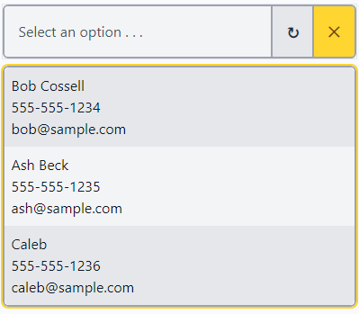

# clsSelector
Simple JS Selector Class that is populated with json data

## Screenshots




## Usage
Download the latest release from the release section

#### HTML
```
    <div class="mySelector"></div>
```

#### Empty List
```
    let selector = new clsSelector(
    {
        containerElement: document.querySelector('.mySelector'),
        minSearchLen: 3,
    });
```

#### Refresh
```
    let selector = new clsSelector(
    {
        containerElement: document.querySelector('.mySelector'),
        minSearchLen: 3,
        refresh: () =>
        {
            return fetch('/content/js/selectorData.json')
            .then((res) =>
            {
                return {jsonData: res.json(), keysArr: ['id','name', 'email'] };
            });
        }
    });
```

#### LiveSearch
```
    let selector = new clsSelector(
    {
        containerElement: document.querySelector('.mySelector'),
        minSearchLen: 3,
        liveSearch: (term) => 
        {
            return fetch('/content/js/selectorData.json')
            .then((res) =>
            {
            //name, id, phone, email
            return {jsonData: res.json(), keysArr: ['id','name', ['name','phone','email']] };
            });
        }
    }
```

#### onChange
```
    let selector = new clsSelector(
    {
        containerElement: document.querySelector('.mySelector'),
        minSearchLen: 3,
        onChange: () =>
        {
            console.log('onChange option fired');
        }
    });
```

#### addChangeListener
```
    selector.addChangeListener(func)
```

### Options
- minSearchLen - default of 3 char
- refresh - method provided to get a list of possible results used in a static fashion. The refresh button can be pushed to update/repopulate list.
- liveSearch - method provided to search an API given a search term
- onChange - function that will fire when a change occurs

### Usage notes
- Does not work inside an input-group but does work well within a flex-form

### Add single items to selector
```selector.addItem('value1', 'textValue1', 'listValue1');```
or
```selector.addItem('value', 'textValue', 'listValue', 'searchRank');```

### Add simple array of items
```selector.addItems(['one', 'two', 'three']);```

### Arrays of data
#### Preferred
```
selector.addItems([object array], [key array in order of value, textValue, listValue])

or

selector.addItems([{name:'one',id:1,email:'one@sample.com'}, {name:'two',id:2,email:'two@sample.com'}, {name:'three',id:3,email:'three@sample.com'}], ['id','name','email'])

or 
fetch('/content/js/selectorData.json')
.then((res) =>
{
    res.json().then((result) =>
    {
        selector.addItems(result, ['id','name', 'email']);
    });
});
```

### Note on Search Rank from API
Be sure a key exists for searchRank. Only works for json set that contains keys and not simple arrays
- ToDo:// pass in key for searchRank if different than searchRank

#### Fallback
```
selector.addItems([{name:'one',id:1,email:'one@sample.com'}, {name:'two',id:2,email:'two@sample.com'}, {name:'three',id:3,email:'three@sample.com'}]);
selector.addItems([['one',1,'one@sample.com'], ['two',2,'two@sample.com'], ['three',3,'three@sample.com']]);
```
- Assumes a pattern of ```value, textValue, listValue```
- Then defaults to ```value, textValue``` or ```value, textValue, textValue```
- Finally ```value``` or ```value, value, value```

### Stacked Mapping of Display Value
```
selector.addItems([{name:'one',id:1,email:'one@sample.com'}, {name:'two',id:2,email:'two@sample.com'}, {name:'three',id:3,email:'three@sample.com'}], ['id','name',['name','phone','email']])
```
or
```
    let selector = new clsSelector(
    {
        containerElement: document.querySelector('.mySelector'),
        refresh: () =>
        {
            return fetch('/content/js/selectorData.json')
            .then((res) =>
            {
            //name, id, phone, email
            return {jsonData: res.json(), keysArr: ['id','name', ['name','phone','email']] };
            });
        }
    });
```
or
```
    fetch('/content/js/selectorData.json')
    .then((res) =>
    {
        res.json().then((result) =>
        {
        //Stacked mapping
        selector.addItems(result, ['id','name', ['name','phone','email']]);
        });
    });
```

### Change Events
- onChange: () => {}; - Passed in as an option
- selector.addChangeListener(() => {}); - Built externally

## Development

### Setup
- npm i -g tailwindcss
- npm install
- npm update

### Dependencies

#### Theme
Use latest PEC theme www folder https://github.com/PEC-Development-Team/T3-Tailwind-Theme replacing local
- www/content/css/tailwindTheme.css
- www/Form.html (for reference)

#### clsBaseClass.js
Depends on clsBaseClass.js https://github.com/Kitchen-JS/clsBaseClass.js

### Edit
/tailwindInput/clsSelector.css
/www/content/js/clsSelector.js

### Run
1st Terminal
```
npm run build-run
```
2nd Terminal
```
node serve
```

### Tests
```
selector.addItems([]); //Empty
selector.addItems({}); //Object instead of array
selector.addItems(); //Nothing
```

### Build/Package JavaScript/CSS
npm run build

#### Just JavaScript output
node build

# Build System Notes
```
I stumbled across a trick using tailwind to build just the css for components while flushing out the new selector and putting together a build system.

I placed the existing built T3 Tailwind theme css (already compiled) in a folder being watched by Tailwind cli while outputting a new css for just the selector and it did not put all the defaults into the new css.
So it still built from the apply statements and combined those with any custom css to the new file.

Next to try is to put a dummy tailwind theme css in the watched folder that has all the basics but none of our components in place to make the new component stand alone ready as well as compatible with our theme.

The rest of the build system copies the new content (css/js) to a output folder and adds version/dev info to the top so we know what version is in use on projects.

So what? This could build for Kitchen Windows, Date Picker, Data Table etc while not doubling up on existing theme content. 

So what? This may be a way to create individual themes, add colors, etc
```
